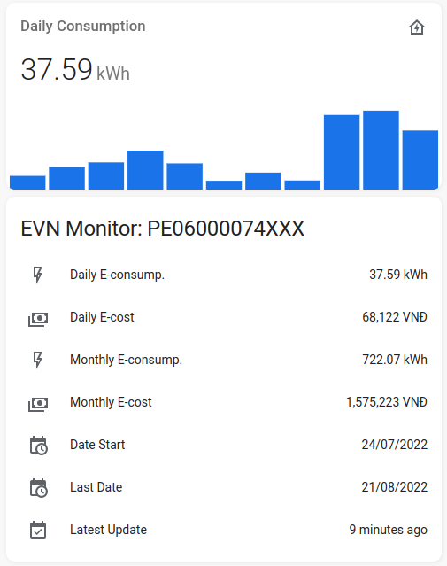
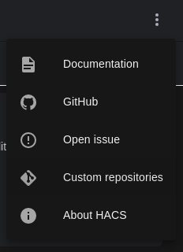
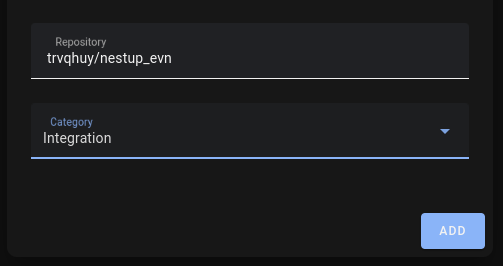
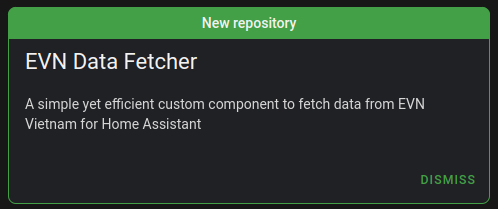
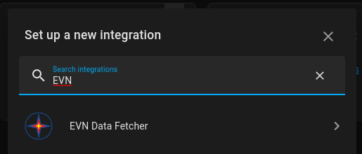
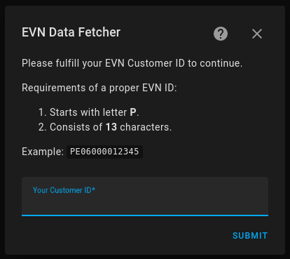
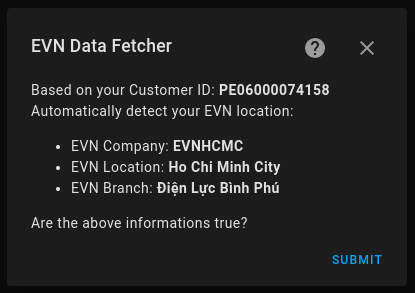

[![hacs][hacs-badge]][hacs]
[![Project Maintenance][maintenance-badge]][maintenance]
[![Code Style][black-badge]][black]

# Vietnam EVN Data Fetcher for HA

English | [Tiếng Việt](https://github.com/trvqhuy/ha-evn/blob/main/README_vn.md)

This component utilized the simple yet powerful **HTTP(S)** protocol to periodically fetch the latest e-consumption data from [EVN Endpoint](https://www.evn.com.vn) into [Home Assistant](https://www.home-assistant.io) with **AIOHTTP** module (and a brilliant assist from **BeautifulSoup** for scaping useful data). 

Hence, it supports installation through UI, and can easily integrate monitoring devices into HA without configuring yaml.



## Before Installation
There are some EVN branches that require authentication to fetch the daily electric consumption data, but orthers do not need this field.

A qualified EVN account will consist of:

1. A username (usually your **EVN Customer ID** or **Phone Number**).

2. A password.

**Note**: Check the table below, if your area needed EVN Account to setup the component, please contact the corresponding support center link to get the required credentials.

Starting from the v1.1.9 version, the component has successfully provided support for the areas listed below:

| EVN Branch | Vietnam Area | Is Supported  | Is EVN Account Required | Support Center |
|:---:|:---:|:---:|:---:|:---:|
| EVNHCMC | Ho Chi Minh City | ☑️ | ☑️ | [Link](https://cskh.evnhcmc.vn/lienhe)
| EVNSPC | Southern Vietnam | ☑️ |   | [Link](https://cskh.evnspc.vn/LienHe/CacKenhTrucTuyen)
| EVNNPC | Northern Vietnam | ☑️ |   | [Link](https://cskh.npc.com.vn/Home/LienHeNPC)
| EVNHANOI | Ha Noi Capital | (not yet) | ? | [Link](https://evnhanoi.vn/infomation/lien-he)
| EVNCPC | Central Vietnam | (not yet) | ? | [Link](https://cskh.cpc.vn/lien-he)

> If your area were not yet supported, feel free to [contact me][maintenance], we could make it happen. 
    
## Installation
#### **Note:** Choose 1 from the below methods for setting up the integration.
### Method 1: Installation via [HACS](https://hacs.xyz) (recommended).
1. Add [**trvqhuy/nestup_evn**](https://github.com/trvqhuy/nestup_evn) custom repository to HACS.

    > HACS > Integrations > `Triple dots (in the upper right corner)` > Custom repositories 
    
     
    
    > Enter `trvqhuy/nestup_evn` to `Repository` and choose `Integration` from `Category`
    
     

2. Download the repository to your HA Server.

    > HACS > Integrations > ➕ Explore & download repositories  > `EVN Data Fetcher` > Choose the latest version > Download this repository
    
3. Reboot/restart your HA Server.
4. Voilà, your installation is completed, now you should move to [Configurations](https://github.com/trvqhuy/nestup_evn/edit/main/README.md#setup-and-configurations) section to complete.

### Method 2: Manual installation via Samba / SFTP
1. Clone/download the latest release (or the repos. master branch).

2. Unzip/copy the `custom_components/nestup_evn` folder to the `custom_components` directory of your HomeAssistant installation.
    - The `custom_components` directory depends on your HomeAssistant **configuration directory**. 
    - Usually, the **configuration directory** is within your OS Home Directory `~/homeassistant/`.
    - In other words, the **configuration directory** of HomeAssistant is where the `configuration.yaml` file is located.
    - After a correct installation, your configuration directory should look like the following.
    
        ```
        └── ...
        └── configuration.yaml
        └── secrets.yaml
        └── custom_components
            └── nestup_evn
                └── __init__.py
                └── sensor.py
                └── nestup_evn.py
                └── ...
        ```
    **Note**: if the `custom_components` directory does not exist, you need to create it manually.
 
## Setup and Configurations
### Setting up the integration
1. Search for `EVN Data Fetcher` in installed integrations.
    > Settings > Devices and Services > Integrations > Add Integrations > Find `EVN Data Fetcher`
    
    
    
2. Fulfill your `EVN Customer ID`.

    **Requirements**: the ID must meet all of the conditions below:

    - Consists of exactly **13** characters.
    - Starts with **'P'** letter.
    
     
    
3. Fulfill your `EVN Credentials` (Username & Password).
4. Choose your `Billing Start Date`.
    **Note**: this is the montly billing date of your electric bill from EVN. 
    
    
    
5. Congrats, everything has been done, you can use the component now.

### Configurating installed devices
> This feature has not been released yet, this is a TO-DO task, to which the maintainer himself won't do.

> However, the configuration seems not neccessary to adjust, fixed configurations are listed below.

1. EVN Retail Electricity Tariff:

    The reference would always be `Household Customer Group` although this variable may varies due to usage purpose.
    > Visit this [link](https://www.evn.com.vn/c3/evn-va-khach-hang/Bieu-gia-ban-le-dien-9-79.aspx) for more informations about electricity price.
    
2. Default Polling Interval:

    ` 30 minutes ` is the default interval for fetching new data from EVN, which is reasonable break, otherwise it would take up resources and overwhelm the server.

## Thank and Support

> If your EVN Area were **not supported** by this integration, contact [me](https://github.com/trvqhuy) and together we could make it happen for the community.

> Last word, the maintainer wants to thank himself for making this project happen.

[hacs]: https://github.com/custom-components/hacs
[hacs-badge]: https://img.shields.io/badge/HACS-default-0468BF.svg?style=for-the-badge
[black-badge]: https://img.shields.io/badge/code%20style-black%20&%20flake8-262626.svg?style=for-the-badge
[black]: https://github.com/ambv/black
[maintenance-badge]: https://img.shields.io/badge/MAINTAINER-%40TRVQHUY-F2994B?style=for-the-badge
[maintenance]: https://github.com/trvqhuy
[license-badge]: https://img.shields.io/badge/license-apache2.0-F2994B.svg?style=for-the-badge
[license]: https://github.com/trvqhuy/nestup_evn/blob/main/custom_components/nestup_evn/LICENSE
