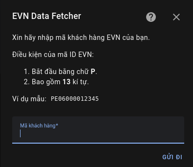
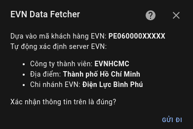
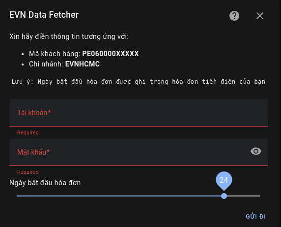
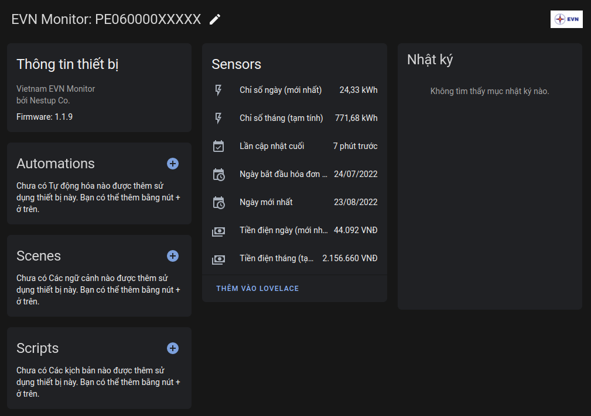

[![hacs][hacs-badge]][hacs]
[![Project Maintenance][maintenance-badge]][maintenance]
[![Code Style][black-badge]][black]

# Công cụ theo dõi dữ liệu điện tiêu thụ từ EVN Việt Nam dành cho HomeAssistant

#### [English](https://github.com/trvqhuy/ha-evn/blob/main/README.md) | Tiếng Việt

Từ việc sử dụng các phương thức có sẵn từ module **AIOHTTP** thông qua giao thức **HTTP(S)** cơ bản, công cụ có thể theo dõi dữ liệu điện năng tiêu thụ từ [EVN](https://www.evn.com.vn) trực tiếp trong [Home Assistant](https://www.home-assistant.io), hiện tại đã hỗ trợ cho **tất cả vùng miền** tại Việt Nam cùng với chi nhánh EVN tương ứng (xem tại [danh sách phía dưới](https://github.com/trvqhuy/nestup_evn/edit/main/README_vn.md#l%C6%B0u-%C3%BD-tr%C6%B0%E1%BB%9Bc-khi-c%C3%A0i-%C4%91%E1%BA%B7t)).

Công cụ hỗ trợ cài đặt và chỉnh sửa trực tiếp thông qua UI, dễ dàng quản lí các thông số điện tiêu thụ qua các thiết bị theo dõi tập trung.


## Lưu ý trước khi cài đặt
Có một số vùng miền **cần** sử dụng tài khoản EVN để nhận dữ liệu điện năng tiêu thụ từ máy chủ EVN, nhưng một số khác thì không.

**Chú ý**: Kiểm tra ở bảng phía dưới, nếu như khu vực của bạn cần tài khoản EVN, liên hệ với TTCSKH (Trung tâm Chăm sóc Khách Hàng) để xin thông tin đăng nhập (và tất nhiên, mã khách hàng):

| Chi nhánh EVN | Khu vực | Đã hỗ trợ | Cần tài khoản xác thực | TTCSKH |
|:---:|:---:|:---:|:---:|:---:|
| EVNHCMC | Thành phố Hồ Chí Minh | ☑️ | ☑️ | [Link](https://cskh.evnhcmc.vn/lienhe)
| EVNSPC | Các tỉnh miền Nam | ☑️ |   | [Link](https://cskh.evnspc.vn/LienHe/CacKenhTrucTuyen)
| EVNNPC | Các tỉnh miền Bắc | ☑️ |   | [Link](https://cskh.npc.com.vn/Home/LienHeNPC)
| EVNHANOI | Thành phố Hà Nội | ☑️ | ☑️ | [Link](https://evnhanoi.vn/infomation/lien-he)
| EVNCPC | Các tỉnh miền Trung | ☑️ | ☑️ | [Link](https://cskh.cpc.vn/lien-he)
    
## Cài đặt
#### **Chú ý:** Sử dụng 1 trong những cách phía dưới để cài đặt công cụ vào HA.
### Cách 1: Cài đặt thông qua [HACS](https://hacs.xyz) (khuyến nghị).
1. Tải repository package về máy chủ HA.

     

    > HACS > Integrations > ➕ Explore & download repositories  > `EVN Data Fetcher` > `Chọn phiên bản mới nhất` > Download this repository
    
3. Khởi động lại HomeAssistant.
4. Cài đặt thành công, tiếp theo đến bước [Config](https://github.com/trvqhuy/nestup_evn/edit/main/README.md#setup-and-configurations) để hoàn thành.

### Method 2: Cài đặt thủ công thông qua Samba / SFTP
1. Tải phiên bản mới nhất của công cụ thông qua [Github](https://github.com/trvqhuy/nestup_evn.git).

2. Giải nén thư mục `custom_components/nestup_evn` vào thư mục `custom_components` trong HomeAssistant của bạn.
    - Thư mục `custom_components` phụ thuộc vào **thư mục cài đặt** HomeAssistant của bạn. 
    - Thông thường, **thư mục cài đặt** HomeAssistant sẽ là `~/homeassistant/`.
    - Nói cách khác, **thư mục cài đặt** HomeAssistant là thư mục chứa file `configuration.yaml`.
    - Sau khi cài đặt đúng, đường dẫn sẽ có dạng:
    
        ```
        └── ...
        └── configuration.yaml
        └── secrets.yaml
        └── custom_components
            └── nestup_evn
                └── __init__.py
                └── sensor.py
                └── nestup_evn.py
                └── ...
        ```
    **Chú ý**: nếu thư mục `custom_components` không tồn tại, bạn phải tự tạo nó.
 
## Thiết lập và Chỉnh sửa
### Cách thiết lập công cụ
1. Tìm công cụ `EVN Data Fetcher` trong những công cụ đã tải về.
    > Settings > Devices and Services > Integrations > Add Integrations > Tìm `EVN Data Fetcher`
    
    
    
2. Điền `Mã khách hàng`.

    **Yêu cầu**: Mã khách hàng của bạn phải thỏa những điều kiện sau:

    - Chứa từ **11** tới **13** kí tự.
    - Bắt đầu bằng chữ **'P'**.
    
     
    
3. (Nếu có) Điền `Tài khoản EVN`
4. Chọn `Ngày bắt đầu hóa đơn`.
    **Chú ý**: đây là ngày bắt đầu tính hóa đơn điện của mỗi tháng. 
    
    
    
5. Hoàn thành, bây giờ bạn có thể thấy thiết bị theo dõi của mình ở phần Devices.
    
    

### Chỉnh sửa thông số
> Hiện tại, sau khi đã thiết lập, các thông số của công cụ chưa thể chỉnh sửa, có thể tính năng này sẽ được cập nhật trong tương lai, hoặc có thể không.

> Tuy nhiên, những thông số này "có vẻ như" sẽ không cần phải chỉnh sửa, hiện tại đã được gán mặc định như bên dưới.

1. Giá bán lẻ điện EVN:

    Mặc dù có nhiều loại biểu giá tùy vào mục đích sử dụng điện, nhưng dự án này sẽ mặc định tính giá tiền điện theo biểu giá bán lẻ của nhóm đối tượng `Sinh Hoạt`.
    > Truy cập [link](https://www.evn.com.vn/c3/evn-va-khach-hang/Bieu-gia-ban-le-dien-9-79.aspx) này để xem biểu giá bán lẻ tiền điện của EVN.
    
2. Chu kì cập nhật dữ liệu mới từ EVN:

    ` 60 phút ` là chu kì mặc định giữa các lần cập nhật dữ liệu điện tiêu thụ từ EVN.

## Dành cho dự án

#### Xin phép được gửi lời cảm ơn đến:

- Anh **Pham Dinh Hai** và anh **Huynh Nhat**, vì đã tin tưởng, cung cấp thông tin tài khoản EVNHANOI và EVNCPC, nhờ vậy chủ repo có đủ điều kiện cần thiết để code hỗ trợ cho khu vực Hà Nội và miền Trung Việt Nam.  

- Anh **Nguyen Huu Thanh**, vì những đóng góp cực kì nhiệt tình đối với khu vực EVNCPC miền Trung.

> Không có những người kể trên, repo `nestup_evn` sẽ không ở đây, trở thành một dự án open-source tới cộng đồng HA Việt Nam.

> Lời cuối, chủ repo cũng muốn tự cảm ơn bản thân vì đã kiên trì tạo ra integration này dành cho mọi người.

[hacs]: https://github.com/custom-components/hacs
[hacs-badge]: https://img.shields.io/badge/HACS-default-0468BF.svg?style=for-the-badge
[black-badge]: https://img.shields.io/badge/code%20style-black%20&%20flake8-262626.svg?style=for-the-badge
[black]: https://github.com/ambv/black
[maintenance-badge]: https://img.shields.io/badge/MAINTAINER-%40TRVQHUY-F2994B?style=for-the-badge
[maintenance]: https://github.com/trvqhuy
[license-badge]: https://img.shields.io/badge/license-apache2.0-F2994B.svg?style=for-the-badge
[license]: https://github.com/trvqhuy/nestup_evn/blob/main/custom_components/nestup_evn/LICENSE
